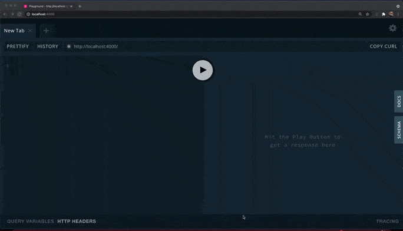
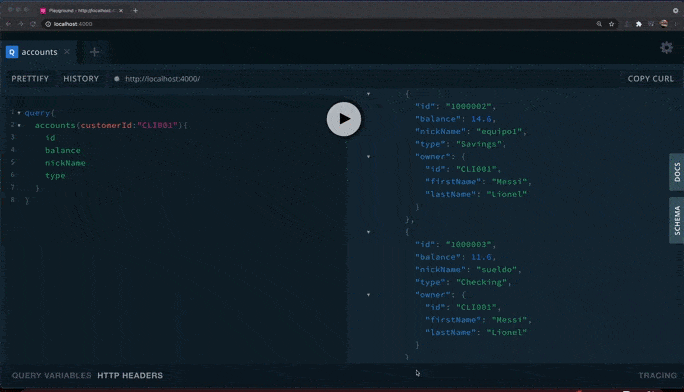

# bank-graphql

1. Iniciar proyecto
    ```script
    npm install
    npm start
    ```

1. Query 1
    Listar cliente con sus contactos y cuentas
     
    
1. Query 2
    Listar movimientos de una cuenta
     